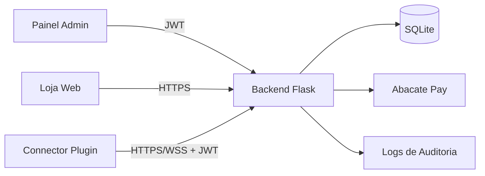
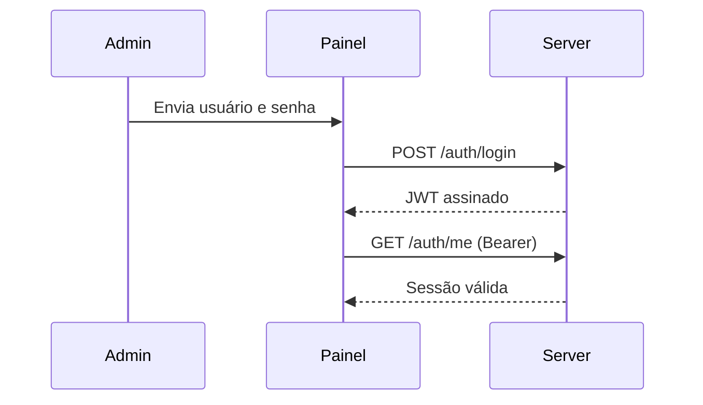
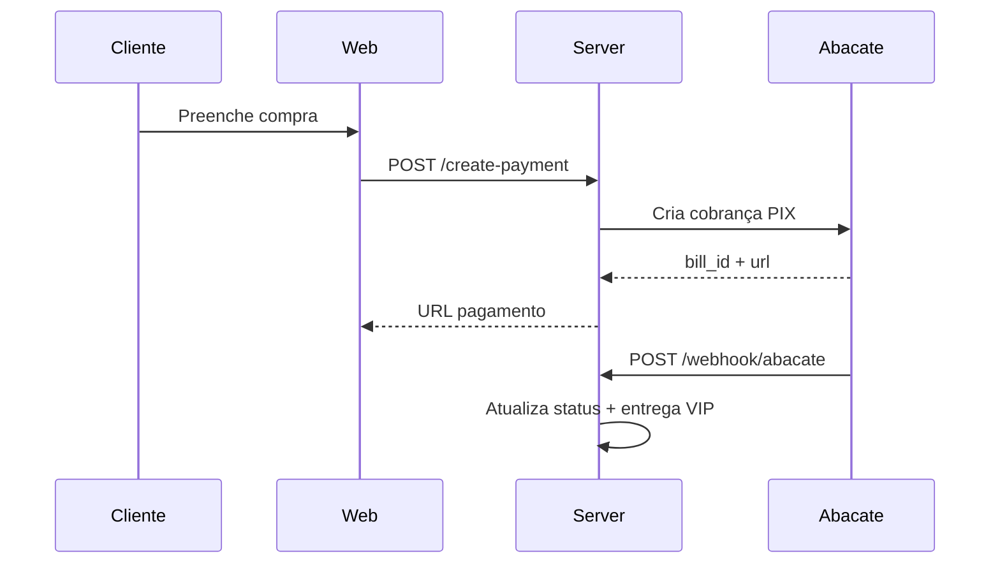

# Manual Técnico Simplificado

## Visão Geral

O sistema possui três blocos principais:

1. Frontend da loja e painel administrativo.
2. Backend Flask com autenticação JWT, auditoria e integrações de pagamento.
3. Plugin de conexão seguro para sincronização de dados com retry e cache offline.

## Arquitetura

## Fluxo de Autenticação

## Fluxo de Pagamento e Entrega

## Zero-Configuration CLI

- `setup.ps1` prepara ambiente e cria `.env` padrão.
- `deploy.ps1` executa testes e deploy automatizado na Vercel.
- `npm run setup:zero` e `npm run deploy:zero` encapsulam execução via CLI.

## Segurança Implementada

- Hash de senha com PBKDF2-HMAC-SHA256.
- JWT assinado por HMAC SHA256 com expiração.
- Endpoints administrativos protegidos com bearer token.
- Validação de entrada para autenticação e pagamentos.
- Logs de auditoria persistidos em `audit_logs`.
- Webhook com validação opcional por segredo compartilhado.

## Operação

1. Execute `powershell -ExecutionPolicy Bypass -File .\setup.ps1`.
2. Inicie o backend com `python server.py`.
3. Acesse `painel/index.html` e autentique com usuário administrador.
4. Consulte o contrato da API em `http://localhost:5000/swagger.json`.
