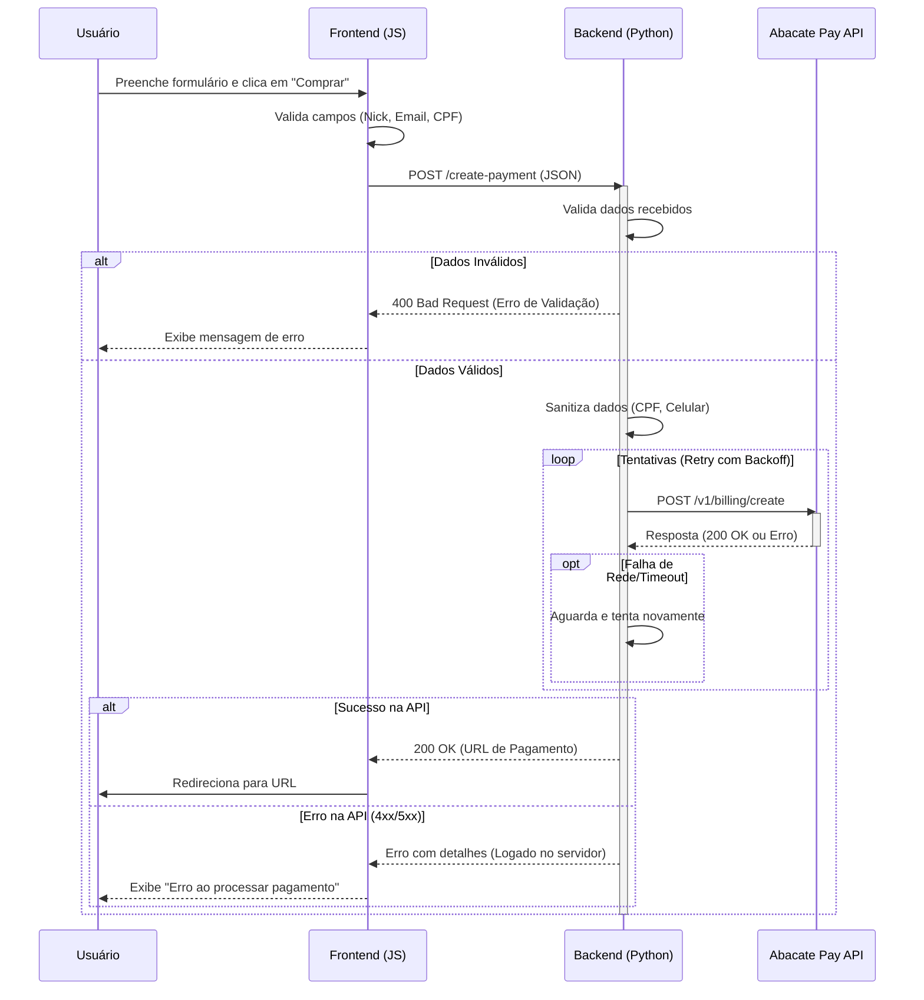

# Guia de Troubleshooting e Arquitetura do Pagamento

Este documento detalha a implementação do fluxo de pagamento, possíveis erros e como solucioná-los.

## Arquitetura e Fluxo de Pagamento

O sistema utiliza um backend Python (Flask) como intermediário entre o frontend e a API do Abacate Pay. Isso garante segurança (tokens não expostos) e robustez (tratamento de erros centralizado).

### Diagrama de Sequência



## Logs e Monitoramento

O servidor gera logs detalhados em `server.log` e na saída padrão (console).

**Níveis de Log:**
- `INFO`: Início de requisições, sucessos.
- `WARNING`: Falhas de validação (dados do cliente incorretos).
- `ERROR`: Falhas de comunicação com API, respostas inesperadas, exceções.

**Exemplo de Log de Erro:**
```
2026-02-15 16:30:00,123 - __main__ - ERROR - [1708025400123] Abacate Pay API Error (401): {"error": "Unauthorized"}
```

## Problemas Comuns e Soluções

### 1. "Abacate Pay API Error"
**Sintoma:** O usuário vê um popup com esta mensagem.
**Causa:** O backend recebeu uma resposta de erro da API do Abacate Pay.
- **Erro 422 (Unprocessable Entity):** Geralmente ocorre se enviar métodos de pagamento inválidos (ex: `CREDIT_CARD` em vez de `CARD` ou se a conta só aceita PIX).
- **Erro 401 (Unauthorized):** Token inválido.
**Solução:**
1. Verifique o arquivo `server.log` para ver a resposta exata da API (campo `details`).
2. Se for erro 422 em `methods`, ajuste a lista de métodos em `server.py` (atualmente configurado apenas para `["PIX"]` para garantir compatibilidade).
3. Se for `401`, verifique o `.env`.

### 2. "Payment Gateway Timeout"
**Sintoma:** O processamento demora mais de 30 segundos e falha.
**Causa:** A API do Abacate Pay não respondeu a tempo ou há problemas de conexão.
**Solução:**
1. O sistema já possui retries automáticos. Se falhar persistentemente, verifique a conexão de internet do servidor.
2. Aumente o `API_TIMEOUT` no `.env` (padrão: 30s).

### 3. "Missing required fields"
**Sintoma:** Erro 400 imediato.
**Causa:** O frontend enviou um JSON incompleto.
**Solução:**
1. Verifique se o frontend está enviando `nickname`, `email`, `cpf` e `product`.
2. O campo `cellphone` é opcional; se ausente, o backend usa um padrão (`5511999999999`).

### 4. Erro de Conexão (Connection Error)
**Sintoma:** Falha imediata ao tentar conectar.
**Causa:** Servidor sem internet ou DNS falhando.
**Solução:** Verifique a conectividade de rede do servidor.

## Testes

Para validar a correção, execute o script de teste automatizado:
```bash
python test_server.py
```
Este script simula cenários de sucesso, falha de validação, timeouts e erros de API.
